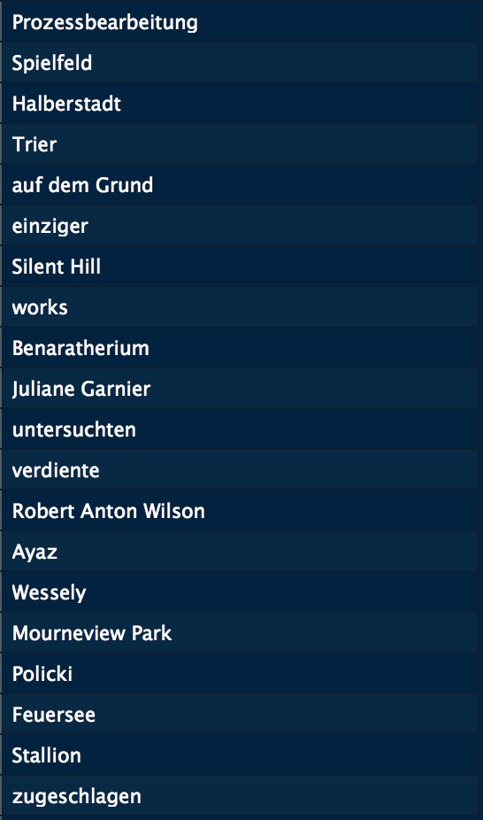
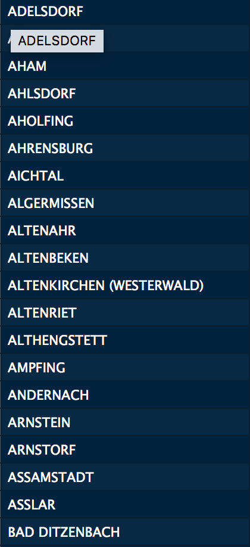

### Outline
1. Introduction
2. Vocabulary and Dataset
3. Methods and Procedure
	* 3.1. Preprocess
		- Selection and Extraction of Dataset
		- String to String Distance
	* 3.2 Clustering
		- Recenter Function
		- String to Cluster Distance
4. Display
	* TagPie
	* Map


#1 Introduction
As part of the Text Mining module at the University of Leipzig we had the task of clustering and classifying words based on substrings. Based on Wikipedia's german vocabulary, we tried to cluster over 2000 words using the Levenshtein-distance and the k-means-algorithm. 

Unfortunately, the selected dataset of german vocabulary was dirty and due to computational effort, we had to limit ourselves to a smaller amount.

Thatswhy, we chose a new set of German city names instead in order to present our results more impressively. We used an algorithm based on n-grams to compute string distances and then to cluster them using the Lyoud-k-means algorithm.

#2 Vocabulary and Dataset

|1. vocabulary| 2. cities|
|-------------|----------|
||

The tables shown here are the starting point for calculating string distances. The first table shows the german vocabulary with some unclean entries like numeric values in line 19 or 25.  


# CluString


# 0. Datastructures

## wordlist : Vector

```r
wordlist <- c("Haus", "Graus", "Flugzeug")
```

## distanceMatrix : Matrix

|       | word1 | word2 | word3 |
|-------|-------|-------|-------|
| word1 | 0     | x     | y     |
| word2 | x     | 0     | z     |
| word3 | y     | z     | 0     |


## hierarchy  : Dataframe

|   cluster   | partOf  | center | sumOfDistances |  count  |
|-------------|---------|--------|----------------|---------|
| integer ≠ 0 | integer | string | double         | integer |

## taxonomy : Dataframe

| string  | cluster  | distanceToCenter |
|---------|----------|------------------|
| string  | integer  | double           |


# 1. Vocabulary

A list of words is generated from an inputfile.

```r
vocabulary( filename, ?size ) -> wordlist
```

# 2. Preprocess

To prevent redundant computation a matrix containing the stringdistances is precomputed.
The measure of stringdistance can be chosen.

```r
preprocess(wordlist, distanceFunction) -> distanceMatrix
```

### String to String Distance Functions
  1. Levenshtein
  2. Damerau–Levenshtein
  3. Sørensen–Dice
  4. Longest common substring
  5. Jaro–Winkler
  6. 2-Gram
  7. 3-Gram
  8. 4-Gram


# 3. Cluster

Similar strings are aggregated in clusters by a chosen clustering-algorithm.

```r
cluster(distanceMatrix, clusterFunction, ?recenterFunction, ?stringToClusterDistanceFunction, ?clusterToClusterDistanceFunction, ?kMeans) -> list(taxonomy=taxonomy, hierarchy=hierarchy)
```

### Cluster Functions
  1. Lloyd-Algorithm (k-means)
  2. Stream
  3. MacQueen’s Algorithm (k-means)
  4. SingleLink (hierarchical)
  5. Ward (hierarchical)
  6. Divisive Analysis Clustering (hierarchical)

### Recenter Functions
  1. Optimal: Pick best from all elements
  2. Random: Pick best from 30 random elements
  3. Heuristical: Pick best from 30 strings closest to current center

### String to Cluster Distance Functions
  1. Center: use center
  2. Sample: use mean of random sample
  3. Full: use mean of all strings

### Cluster to Cluster Distance Functions
  1. Center: use center
  2. Sample: use mean of random sample
  3. Full: use mean of all strings

# 4. Display

```r
displayCluster(taxonomy, hierarchy) -> {}
```

  1. TagPie
  2. Map 
